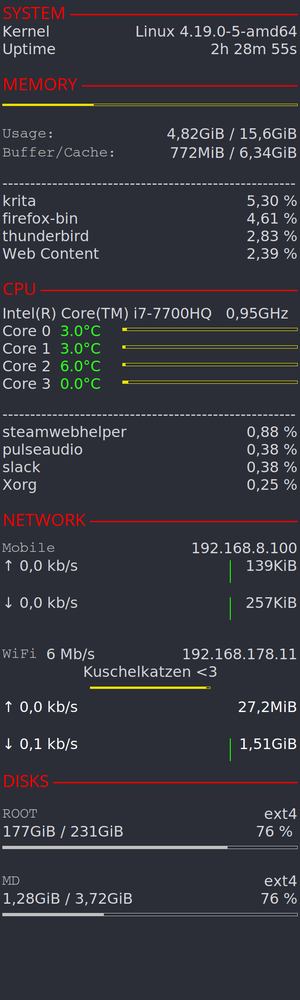

Saya
====
This is an Conky metrics theme.
Tested with MX Linux and an display resolution of 3840 x 2160.
__

Install notes
-------------
Currently the network interfaces are hardcoded.
So please change it, if neccessary.
To get a list of your network interfaces, use the command `cd /sys/class/net && ls --ignore=lo`

License
-------
This project is free software under the terms of the GNU General Public License v3 as published by the Free Software Foundation.
It is distributed WITHOUT ANY WARRANTY (without even the implied warranty of MERCHANTABILITY or FITNESS FOR A PARTICULAR PURPOSE).
For more details please see the LICENSE file or: http://www.gnu.org/licenses

Credits
-------
Git repository: https://github.com/vivi90/saya.git
Based on: https://github.com/MX-Linux/mx-conky-data/tree/master/MX-KoO
